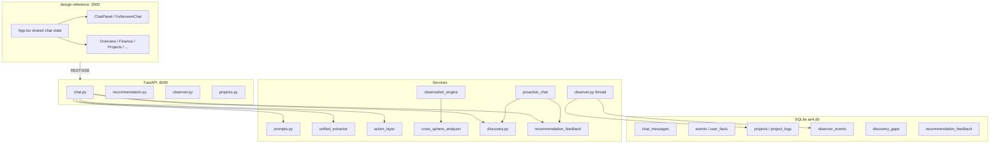

# DEV_STATUS.md
# AIR4 — Development Status

> **Единый источник правды** для всех сессий разработки в Cursor.  
> Читать перед началом работы. Обновлять после каждого значимого изменения.  
> `PROGRESS.md` упразднён 22 мая 2026.

---

## Статус на сегодня

**Дата аудита:** 27 июня 2026  
**Текущий спринт:** Sprint 15 (Feedback Loop + UX polish)  
**Фаза:** Phase 6.5 — Real Usage Validation

AIR4 — персональный проактивный AI-ассистент. Backend: FastAPI + SQLite. Frontend: React/Vite в `design-reference/` (порт 3000). LLM: Claude Sonnet (чат, morning brief) + Haiku (экстракторы, observations, nudges, action detection).

**Стек:** FastAPI `:8000` · React/Vite `design-reference` `:3000` · SQLite `backend/data/air4.db` · Anthropic API

---

## 1. История спринтов

### Sprint 1–2 (май 2026) — Foundation
- Swedbank CSV upload → `transactions`, `uploads`, `insights`
- Базовый чат с Claude
- Первые экстракторы: events, facts
- `parser.py`, `categorizer.py`, finance summary

### Sprint 3 (май 2026) — Memory layer
- `events`, `user_facts`, `user_profile`
- Endpoints: profile, goals, hypotheses, health metrics/workouts
- Начало structured memory

### Sprint 4 (май 2026) — Projects & Health
- Projects CRUD, `project_logs`, `project_todos`
- `health_checkups` — импорт анализов крови
- Interview system (`interview_answers`)
- UI redesign в `design-reference/`

### Sprint 5 (май 2026) — Recurring finance
- Таблицы `subscriptions`, `obligations`, `income_sources`
- FullscreenChat с контекстными pills (summary, projects, dilemmas)
- Chat context по доменам

### Sprint 6 (май 2026) — Cycles & Feed
- Зарплатный цикл 10→10 (`/api/finance/cycles`)
- `chat_messages` — полная история чата в БД
- Live Feed (`feed.py`) — агрегация 6 источников

### Sprint 7 (май 2026) — Streaming & i18n
- Настоящий SSE streaming в `/api/chat`
- Русский UI (sidebar labels, page headers)
- SQLite tuning: WAL, foreign_keys, cache_size

### Sprint 8–10 (май 2026) — Patterns & Decisions
- Cross-sphere analyzer + `cross_sphere_insights`
- Dilemmas / Decision Memory Layer
- File upload в чат (image/PDF attachments)
- Finance forecast, category rules

### Sprint 11 (июнь 2026) — Sport & dedup
- `workout_extractor` — тренировки из чата
- Event dedup cleanup (634→494 events)
- Coaich import script

### Sprint 12 (июнь 2026) — Jarvis mode
- Energy State: quiet / normal / active / jarvis (`air4_mode`)
- Domain recommendations (`/api/air4/recommendations`)
- Overview advisor format в prompts

### Sprint 13 (июнь 2026) — Mobile & unified extraction
- Morning brief v1
- `unified_extractor` — один Haiku-вызов вместо четырёх
- Mobile (<768px) → только FullscreenChat
- Dark theme Overview
- Удалена старая папка `frontend/`
- Tailscale access

### Sprint 14 (июнь 2026) — Proactive AIR4 + Observer
- **macOS Observer** — фоновый тред, AppleScript, `observer_events`
- **Proactive chat** — morning brief (Sonnet), observer nudge (Haiku)
- **Discovery engine** — `discovery_gaps`, 19 категорий, learning из чата
- **Action layer** — detect + confirm pending data mutations
- **Training log import** — `.md` upload на Sport page
- Periodic flush observer sessions, project auto-link
- Overview tile «АКТИВНОСТЬ СЕГОДНЯ»
- `AIRCH_TEST_MODE` — пониженные пороги для QA

### Sprint 15 (июнь 2026, в процессе) — Feedback Loop + polish
- **Feedback Loop MVP** — `recommendation_feedback`, detection после ответа, `feedback_extractor`, follow-up в morning brief, блок `[РЕЗУЛЬТАТЫ РЕКОМЕНДАЦИЙ]` в system context
- **Cache persistence** — `overview_cache` и `morning_brief_cache_YYYY-MM-DD` в `_app_meta` (TTL 30 мин / per-day)
- **Overview transparency** — ссылки «Почему?» + иконка `?` → чат с pre-filled вопросом
- **Projects status** — `update_project` в action_layer, `PUT /api/projects/{id}`, dropdown в UI, PUT proxy в `server.ts`
- **Observer browsers** — Chrome, Arc, `_parse_browser_domain()`, `BROWSER_MIN_DURATION=30`
- **Chat state lifting** — `chatMessages` + `pendingActions` в `App.tsx`, persist при panel ↔ fullscreen
- **CHARACTER_SYSTEM** — ПРОЗРАЧНОСТЬ, ПОДДЕРЖКА РЕШЕНИЙ (A/B/C), СТИЛЬ ДИАЛОГА, ФОКУС НА ТЕМЕ (спорт последним), НЕЗАВЕРШЁННЫЕ ДЕЙСТВИЯ, ОСТОРОЖНЫЕ ВЫВОДЫ

---

## 2. Текущее состояние — что работает

### 2.1 Backend endpoints (по доменам)

Все роутеры в `main.py`. Prefix `/api`, кроме recommendation → `/api/air4`.

#### Health & infra
| Method | Path | Описание |
|--------|------|----------|
| GET | `/health` | `{"status":"ok"}` |

#### Finance
| Method | Path | Описание |
|--------|------|----------|
| POST | `/api/upload` | Swedbank CSV → transactions + categorization |
| GET | `/api/uploads` | Список загрузок |
| DELETE | `/api/uploads/{id}` | Удалить загрузку |
| GET | `/api/summary` | Сводка трат/дохода за период |
| GET | `/api/finance/cycles` | Зарплатные циклы 10→10 |
| GET | `/api/transactions` | Пагинированные транзакции |
| PUT | `/api/transactions/{id}/category` | Смена категории + category_rules |
| GET | `/api/insights` | Finance insights по upload |
| GET | `/api/category-rules` | Правила категоризации |
| GET/POST/PUT/DELETE | `/api/finance/subscriptions` | Подписки |
| GET/POST/PUT/DELETE | `/api/finance/obligations` | Кредиты и обязательства |
| GET | `/api/finance/monthly-fixed` | Итого фикс. расходов в месяц |

#### Chat & proactive
| Method | Path | Описание |
|--------|------|----------|
| POST | `/api/chat` | Claude Sonnet, SSE streaming, attachments, domain agents, action detection |
| GET | `/api/chat/history` | История `chat_messages` (limit 1–500) |
| POST | `/api/chat/confirm-action` | Подтверждение pending data action |
| POST | `/api/chat/cancel-action` | Отмена pending action |
| GET | `/api/chat/morning-brief` | Proactive opening (Sonnet, multi-signal, daily cache) |
| GET | `/api/chat/observer-nudge` | Nudge при долгой сессии в одном app |

#### Memory & knowledge
| Method | Path | Описание |
|--------|------|----------|
| GET | `/api/events` | Life events (+ project_logs как events) |
| GET | `/api/profile` | Profile + user_facts bundle |
| GET | `/api/goals` | Цели (profile + facts, dedup) |
| GET | `/api/hypotheses` | Гипотезы о пользователе |
| GET | `/api/identity` | Identity model insights |
| GET | `/api/discovery/gaps` | Discovery gaps (что AIR4 ещё не знает) |
| GET | `/api/interview/question` | Interview вопрос (cooldown 3 дня) |
| PUT | `/api/interview/answer` | Ответ на interview |
| GET | `/api/followups` | Follow-up reminders |
| GET | `/api/feedback` | Recommendation feedback rows |

#### Observations & patterns
| Method | Path | Описание |
|--------|------|----------|
| GET | `/api/observations` | AIR4 observations |
| POST | `/api/observations/generate` | Ручная генерация |
| GET | `/api/cross-sphere` | Cross-sphere insights |
| GET | `/api/feed` | Live Feed (6 источников) |

#### Dilemmas
| Method | Path | Описание |
|--------|------|----------|
| GET | `/api/dilemmas` | Список дилемм |
| POST | `/api/dilemmas` | Создать |
| PATCH | `/api/dilemmas/{id}` | Обновить |
| GET | `/api/dilemmas/pending-followups` | Ожидающие follow-up |
| POST | `/api/dilemmas/{id}/followup-answer` | Ответ на follow-up |
| GET | `/api/dilemmas/stats` | Статистика |

#### Projects
| Method | Path | Описание |
|--------|------|----------|
| GET/POST | `/api/projects` | Список / создание |
| GET | `/api/projects/{id}` | Деталь + logs + active session |
| PUT | `/api/projects/{id}` | Обновление status (active/paused/stalled/completed/archived) |
| PUT | `/api/projects/{id}/goals` | Привязка goal_keys |
| GET/POST | `/api/projects/{id}/logs` | Логи активности |
| POST | `/api/projects/{id}/sessions/start` | Старт Pomodoro-сессии |
| POST | `/api/projects/{id}/sessions/stop` | Стоп сессии + duration |
| GET/POST | `/api/projects/{id}/todos` | Todo list |
| PUT | `/api/projects/todos/{id}` | Toggle todo done |

#### Health & sport
| Method | Path | Описание |
|--------|------|----------|
| GET/POST | `/api/health/metrics` | Вес / рост |
| GET/POST | `/api/health/workouts` | Тренировки |
| POST | `/api/health/import-training-log` | Импорт `.md` training log |
| GET | `/api/health/markers/{name}/history` | История биомаркера |
| GET | `/api/health/checkups` | Анализы крови |

#### Observer (macOS)
| Method | Path | Описание |
|--------|------|----------|
| GET | `/api/observer/status` | enabled + running |
| PUT | `/api/observer/toggle` | Вкл/выкл + start/stop thread |
| GET | `/api/observer/today` | Сегодня: events, by_app_aggregated, by_domain |
| GET | `/api/observer/log` | История (days, limit) |

#### AIR4 modes & recommendations
| Method | Path | Описание |
|--------|------|----------|
| GET | `/api/air4/recommendation` | Главная рекомендация (Haiku, cache 30 min в `_app_meta`) |
| GET | `/api/air4/recommendations` | Domain recommendations (finance/projects/health) |
| GET/PUT | `/api/air4/mode` | Energy state: quiet/normal/active/jarvis |

#### Spaces (experimental)
| Method | Path | Описание |
|--------|------|----------|
| POST | `/api/spaces/suggest` | LLM-предложение Space |
| GET/POST | `/api/spaces` | Список / создание |

**Итого:** ~78 endpoints. Аутентификации нет — локальный single-user.

---

### 2.2 Frontend — страницы и компоненты

**Точка входа:** `design-reference/src/App.tsx` — React Router, shared chat state (`chatMessages`, `pendingActions`).

**Mobile (<768px):** только `FullscreenChat`, без sidebar.

#### Страницы (sidebar + routes)

| Page | Route | Компонент | Данные / функции |
|------|-------|-----------|------------------|
| Overview | `/` | `OverviewDashboard.tsx` | summary, projects, workouts, observations, domain recos, observer today, «Почему?» |
| Finance | `/finance` | `Finance.tsx` | transactions, subscriptions, obligations, cycle navigator |
| Health | `/health` | `Health.tsx` | checkups, biomarker trends (`MarkerTrendChart`) |
| Sport | `/sport` | `Sport.tsx` | workouts, metrics, training log upload |
| Projects | `/projects` | `Projects.tsx` | projects, sessions, todos, status dropdown, momentum |
| Goals | `/goals` | `Goals.tsx` | goals, wishlist, deadlines |
| Dilemmas | `/dilemmas` | `Dilemmas.tsx` | dilemmas, follow-ups |
| Patterns | `/patterns` | `Patterns.tsx` | hypotheses, cross-sphere |
| Memory | `/memory` | `Memory.tsx` | events, domain filters |
| Observer | `/observer` | `Observer.tsx` | today bars, history, toggle |
| Profile | `/profile` | `Profile.tsx` | profile, facts |
| Settings | `/settings` | `Settings.tsx` | preferences |
| Chat | `/chat` | `FullscreenChat.tsx` | fullscreen chat, context pills, morning brief |

**Dev-only routes (не в sidebar):** `CSVUpload` (`/csv-upload`), `EmptyStates`, `Toasts`.

#### Ключевые shared-компоненты

| Компонент | Назначение |
|-----------|------------|
| `Sidebar.tsx` | Icon nav 64px, observer status dot |
| `Header.tsx` | Page title, `EnergyStateDropdown` |
| `ChatPanel.tsx` | Embedded chat (desktop), interview, pending actions, proactive hooks |
| `FullscreenChat.tsx` | Full chat, context pills, morning brief label |
| `PendingActionBar.tsx` | Confirm/cancel chat data changes |
| `EnergyStateDropdown.tsx` | quiet / normal / active / jarvis + DND |
| `LiveFeed.tsx` | Overview feed digest |
| `MessageAttachmentView.tsx` | Image/PDF в чате |
| `ProjectGoalLinks.tsx` | Goal pills на projects |
| `OverviewCardEmpty.tsx` / `PageEmptyState.tsx` | Empty states |

#### Frontend libs (`design-reference/src/lib/`)

| Файл | Назначение |
|------|------------|
| `api.ts` | Все fetch/stream helpers (~1750 строк) |
| `proactiveChat.ts` | seen-today tracking, user activity timestamps |
| `useProactiveChatMessages.ts` | morning brief + observer nudge polling |
| `chatStorage.ts` | sessionStorage persist (side effect, не primary source) |
| `chatEvents.ts` | `CHAT_REFRESH_EVENT` после import и т.п. |
| `navigation.ts` | Page ↔ path mapping |
| `chatAttachments.ts` | Image/PDF read/validate |
| `format.ts`, `utils.ts`, `typography.ts` | Утилиты |

**Proxy:** `design-reference/server.ts` — Express dev server, проксирует `/api/*` → `:8000`, включая SSE chat и PUT projects.

---

### 2.3 Backend services (`backend/services/`)

| Сервис | Назначение |
|--------|------------|
| **prompts.py** | `CHARACTER_SYSTEM`, `build_system_context()`, domain contexts, advisor format |
| **llm_client.py** | Chat sync SDK (Sonnet), streaming, JSON parse helpers |
| **llm_client_shared.py** | Async Haiku для экстракторов, observations, nudges |
| **chat_history.py** | save/fetch `chat_messages` |
| **unified_extractor.py** | Один Haiku-вызов: events + workout + facts + decisions + discovery gaps |
| **event_extractor.py** | Life events, dedup thresholds |
| **fact_extractor.py** | `user_facts` upsert |
| **workout_extractor.py** | Workouts из чата, `_is_real_workout()` validation |
| **body_extractor.py** | Weight/height из чата |
| **decision_extractor.py** | Dilemmas / decisions |
| **discovery.py** | `discovery_gaps` seed, get_open_gaps, gap learning из facts/chat |
| **proactive_chat.py** | Morning brief (Sonnet), observer nudge (Haiku), signal collectors |
| **recommendation_feedback.py** | Detection рекомендаций, follow-up scheduling, context block |
| **feedback_extractor.py** | Парсинг ответа пользователя на follow-up |
| **test_mode.py** | `AIRCH_TEST_MODE` — lowered thresholds для QA |
| **observer.py** | macOS app tracking thread, periodic flush, browser domains, project auto-link |
| **observation_engine.py** | Rule layer + LLM observations, 7-day cooldown |
| **cross_sphere_analyzer.py** | Finance ↔ Health ↔ Projects correlations (pure Python) |
| **action_layer.py** | Detect + execute chat actions (subs, projects, workouts, loops…) |
| **subscription_updater.py** | Legacy recurring corrections из chat text |
| **obligation_from_chat.py** | Obligation-specific chat actions |
| **subscription_migration.py** | `user_facts` → subscriptions backfill |
| **followup_extractor.py** | Follow-up questions из чата |
| **identity_extractor.py** | Identity model updates |
| **interviewer.py** | Interview question selection |
| **feed.py** | Live Feed aggregator (6 sources) |
| **summary_loader.py** | Finance summary SQL |
| **parser.py** / **categorizer.py** | Swedbank CSV parse + auto-categorize |
| **finance_facts.py** | Legacy (mostly superseded by subscriptions table) |

#### Background jobs (`main.py` startup)
1. **Observation scheduler** — generate observations + cross-sphere analysis каждые 24h (configurable)
2. **Subscription backfill** — one-time migration via `_app_meta`
3. **Observer thread** — macOS only, если `observer_enabled` в profile

---

### 2.4 Database

**Файл:** `backend/data/air4.db` (SQLite WAL, не в git)  
**Путь:** `DATABASE_URL` env, default `./data/air4.db`

#### Таблицы (32)

| Таблица | Назначение |
|---------|------------|
| `user_profile` | Имя, city, air4_mode, observer_enabled |
| `_app_meta` | Migration flags, caches (overview, morning_brief, nudge cooldown) |
| `user_facts` | Structured facts from chat |
| `embeddings` | ⚠️ declared, unused |
| `events` | Life events |
| `uploads` | CSV upload metadata |
| `transactions` | Bank transactions |
| `insights` | Finance insights per upload |
| `projects` | Projects + goal_keys JSON |
| `project_logs` | Activity logs (manual, observer, chat, session) |
| `project_todos` | Project todos |
| `hypotheses` | User hypotheses |
| `cross_sphere_insights` | Cross-domain patterns |
| `observations` | AIR4 observations |
| `dilemmas` | Decision memory + follow-ups |
| `interview_answers` | Interview responses |
| `workouts` | Training sessions |
| `body_metrics` | Weight/height |
| `health_checkups` | Blood markers |
| `subscriptions` | Recurring subscriptions |
| `obligations` | Loans / fixed obligations |
| `income_sources` | Income keyword matching |
| `chat_messages` | Full chat history + attachments |
| `spaces` | Experimental spaces |
| `identity_model` | Identity insights |
| `followups` | Scheduled follow-ups |
| `open_loops` | Open conversation loops |
| `observer_events` | macOS activity sessions |
| `category_rules` | Transaction categorization rules |
| `discovery_gaps` | What AIR4 still needs to learn |
| `recommendation_feedback` | Advice tracking + follow-up outcomes |

**⚠️ `today_cache`** — referenced в `proactive_chat.get_today_signal()`, но **НЕ в schema**. Query падает silently; morning brief использует fallback (overview cache signal).

#### Текущие объёмы данных (27 июня 2026)

| Таблица | Count | Примечание |
|---------|------:|------------|
| transactions | 943 | 6 uploads Swedbank |
| events | 859 | После дедупа |
| user_facts | 930 | |
| chat_messages | 1086 | 543 user + 543 assistant |
| workouts | 30 | Coaich + chat + imports |
| health_checkups | 101 | Маркеры 2019→2026 |
| observations | 25 | |
| dilemmas | 72 | |
| followups | 24 | |
| subscriptions | 15 | |
| obligations | 3 | |
| projects | 4 | Air4, Ascape (active), SkipMar (completed), Тартупак (stalled) |
| project_logs | 21 | manual + observer + sessions |
| observer_events | 51 | 32 on 2026-06-28, 19 on 2026-06-27 |
| discovery_gaps | 19 | 13 open, 6 learned |
| cross_sphere_insights | 13 | |
| recommendation_feedback | 30 | 30 done |
| hypotheses | 2 | |
| identity_model | 52 | |
| interview_answers | 17 | |
| category_rules | 7 | |
| open_loops | 0 | |
| body_metrics | 11 | |
| spaces | 1 | experimental |

#### `_app_meta` keys (live)
- `subscription_backfill_done`, `air4_mode_migration_done`, `discovery_gaps_seeded`
- `observer_nudge_last_at`
- `overview_cache` (JSON, TTL 30 min)
- `morning_brief_cache_2026-06-28` (per-day)

---

## 3. Архитектура — как системы связаны

### 3.1 Общая схема



### 3.2 Observer → Projects

```
macOS foreground app (AppleScript, 5s poll)
  → TRACKED_APPS map (Cursor→projects, Chrome/Arc→browser, …)
  → idle detection (ioreg, 5 min pause)
  → session end OR periodic flush (5 min / 60s test)
  → observer_events (app, window, duration, domain, project_hint)
  → extract_project_hint(window title) — substring match
  → _match_active_project(hint) → projects WHERE status='active'
  → project_logs (source='observer', duration_minutes)
  → projects.updated_at = observed_at
```

Browser sessions: `_parse_browser_domain()` — claude.ai, github, figma и т.д.; mail tabs skipped; `BROWSER_MIN_DURATION=30`.

Frontend: Overview «АКТИВНОСТЬ СЕГОДНЯ», Observer page bars, Projects tile «активен сегодня» when `updated_at` is today.

### 3.3 Action Layer → DB

```
POST /api/chat (user message)
  → Claude Sonnet streams reply
  → unified_extractor (background): events, facts, workouts, dilemmas, discovery gaps
  → action_layer.detect_actions(): Haiku JSON → pending action
  → Frontend PendingActionBar
  → POST /api/chat/confirm-action
  → action_layer.execute_action():
       subscriptions / obligations / workouts / body_metrics
       project_logs / create_project / update_project (status)
       open_loops / reminders
  → DB write + confirm response
```

Финансовые мутации НЕ inline в ответе — только через confirm flow.

### 3.4 Discovery System

```
init_db → seed_discovery_gaps (19 categories, once via _app_meta)
  → get_open_gaps(conn, limit=3) — priority + recency
  → woven into CHARACTER_SYSTEM + build_system_context [ПРОБЕЛЫ В ЗНАНИЯХ]
  → unified_extractor: apply_facts_to_discovery_gaps + apply_user_text_to_discovery_gaps
  → morning brief: ONE natural question from top gap
  → mark_gaps_asked_in_response after brief sent
```

Gap statuses: `open` → `learned` when keywords/facts match.

### 3.5 Feedback Loop

```
POST /api/chat (assistant reply complete)
  → detect_and_save_recommendation_feedback (Haiku): has_recommendation?
  → recommendation_feedback row (status=pending, follow_up_date +N days)

User returns days later:
  → proactive_chat.get_pending_recommendation_followup → woven into morning brief
  → OR user answers in chat
  → feedback_extractor.extract_feedback_answer (Haiku)
  → apply_feedback_outcome (success/failure/partial, confidence_delta)
  → get_recommendation_feedback_context → [РЕЗУЛЬТАТЫ РЕКОМЕНДАЦИЙ] in system prompt

GET /api/feedback — debug/admin view
```

### 3.6 Proactive chat

**Morning brief triggers** (`GET /api/chat/morning-brief`):
- 4h+ inactivity (5 min in test mode)
- OR stale discovery gap ready to ask
- OR recent observer activity
- OR pending recommendation follow-up due

**Signals combined:** open_loop, discovery_gap, yesterday observer summary, today_signal (⚠️ today_cache missing), pending follow-up.

**Observer nudge** (`GET /api/chat/observer-nudge`):
- 45+ min in same app (2 min test)
- 2h cooldown in `_app_meta` (`observer_nudge_last_at`)

**Frontend:** `useProactiveChatMessages(onMessagesChange, historyReady)` — poll nudge every 15 min; brief seen-today in sessionStorage.

**Caches:** morning brief per-day in `_app_meta`; overview recommendations 30 min TTL.

### 3.7 Chat pipeline (полный путь сообщения)

```
User types → streamChat (SSE)
  → build_system_context():
       profile, facts, finance, projects, workouts, dilemmas,
       observations, cross-sphere, discovery gaps, feedback results,
       observer today, open loops, page context
  → CHARACTER_SYSTEM + domain agent if page=Finance|Health|…
  → Claude Sonnet stream → chat_messages saved
  → background: unified_extractor, action detection, feedback detection, feedback extraction
```

---

## 4. Known issues & tech debt

### Критично / блокеры
| Issue | Impact |
|-------|--------|
| **`today_cache` table missing** | `get_today_signal()` SQL fails; morning brief loses «today signal» dimension |
| **No authentication** | All endpoints open on `0.0.0.0` — ok locally + Tailscale, risky if exposed |
| **Observer macOS-only** | No Linux/Windows tracking |

### Tech debt
- `@app.on_event("startup/shutdown")` deprecated → migrate to lifespan
- Two LLM clients (`llm_client.py` + `llm_client_shared.py`) — merge candidate
- `prompts.py` ~30KB — split into modules
- `chat.py` ~870 lines — split pipeline
- Dead/unused: `embeddings` table, several `events` columns (`original_text`, `embedding_id`)
- Event search — LIKE full scan; needs FTS5 at scale
- Workout dedup by date only — two workouts same day collide
- Duplicate action paths: `subscription_updater` + `action_layer` overlap
- `.env.example` may mention Ollama; production is Anthropic-only
- Debug `console.log` may remain in `Projects.tsx` status dropdown

### Мелкое
- Swedbank parser skips some service rows
- Category `other` noisy (hidden on Overview via `HIDDEN_CATEGORIES`)
- Project hint matching substring-based — false positives possible
- Morning brief + nudge dedup via sessionStorage — not synced across tabs/devices
- `AIRCH_TEST_MODE=true` in `.env` — disable for daily use
- Chat history loads from DB only when `chatMessages` empty in App — correct by design

---

## 5. Следующие приоритеты

### Немедленно (Sprint 15 finish)
1. **`today_cache`** — создать таблицу + writer ИЛИ убрать мёртвый query; подключить к morning brief signal
2. **Отключить `AIRCH_TEST_MODE`** для daily use
3. **Жить с продуктом** — итерировать morning brief / CHARACTER_SYSTEM на реальных диалогах

### Sprint 16
4. **Discovery UX** — показывать gaps пользователю (не только через brief)
5. **Positive patterns** — AIR4 замечает что работает (observation type `positive` exists)
6. **Feedback Loop v2** — UI для pending follow-ups, confidence tuning
7. **Tech debt:** lifespan migration, merge LLM clients

### Phase 7
- Global Session Toggle
- Conversation First — любая сущность через чат
- Financial calendar — разовые обязательства
- Follow-up Engine для dilemmas/events (частично есть)

### Phase 8+
- SQLCipher + auth
- iOS app, push (strong observations only)
- Voice (Whisper + TTS), Apple Health/Calendar

---

## 6. Как запустить

### Требования
- Python 3.11+
- Node.js 20+
- `ANTHROPIC_API_KEY` в `backend/.env`
- macOS для Observer (optional)

### Startup

```bash
# Терминал 1 — Backend
cd backend
uvicorn main:app --reload --host 0.0.0.0 --port 8000

# Терминал 2 — Frontend
cd design-reference
npm install   # первый раз
npm run dev
```

- Backend: http://127.0.0.1:8000
- Frontend: http://localhost:3000
- Health: `GET http://127.0.0.1:8000/health`
- API docs: http://127.0.0.1:8000/docs
- Tailscale: доступ с телефона (настроен Sprint 13)

### Production build (frontend)

```bash
cd design-reference
npm run build
npm start   # node dist/server.cjs
```

### Env vars (ключевые)

| Var | Default | Назначение |
|-----|---------|------------|
| `ANTHROPIC_API_KEY` | — | Claude API (обязательно) |
| `DATABASE_URL` | `./data/air4.db` | SQLite path |
| `AIRCH_TEST_MODE` | false | Lower proactive/observer thresholds |
| `AIR4_LOG_LEVEL` | INFO | Logging level |
| `AIR4_CORS_ORIGINS` | localhost:3000 | CORS |
| `AIR4_PORT` | 8000 | Backend port |
| `AIR4_OBSERVATION_INTERVAL_SECONDS` | 86400 | Observation scheduler interval |
| `AIR4_OBSERVATION_INITIAL_DELAY_SECONDS` | 10 | Delay before first observation run |

---

## Структура проекта

```
AIR4/
├── backend/
│   ├── main.py                 # FastAPI app, schedulers, observer startup
│   ├── database.py             # Schema, migrations, get_db
│   ├── schemas.py              # Pydantic models
│   ├── data/air4.db            # SQLite (not in git)
│   ├── routers/                # 25 router modules
│   ├── services/               # 30 service modules
│   ├── import_workouts.py      # Coaich JSON import
│   ├── import_health_checkup.py
│   ├── import_training_log.py
│   └── cleanup_duplicate_events.py
├── design-reference/           # Active React UI (port 3000)
│   ├── server.ts               # Express dev proxy
│   ├── src/App.tsx
│   ├── src/components/         # 28 components
│   └── src/lib/api.ts
└── DEV_STATUS.md               # ← этот файл
```

---

## Полезные команды

```bash
# Typecheck frontend
cd design-reference && npx tsc --noEmit

# Импорт тренировок Coaich
cd backend && python3 import_workouts.py path/to/backup.json

# Импорт анализов крови
python3 backend/import_health_checkup.py

# Дедуп событий
python3 backend/cleanup_duplicate_events.py          # dry-run
python3 backend/cleanup_duplicate_events.py --apply

# DB sanity check
sqlite3 backend/data/air4.db "SELECT COUNT(*) FROM observer_events;"
sqlite3 backend/data/air4.db "SELECT name, status, updated_at FROM projects;"
sqlite3 backend/data/air4.db "SELECT status, COUNT(*) FROM discovery_gaps GROUP BY status;"
sqlite3 backend/data/air4.db "SELECT status, COUNT(*) FROM recommendation_feedback GROUP BY status;"
```

---

*Последнее обновление: 27 июня 2026 — полный аудит кодовой базы.*
